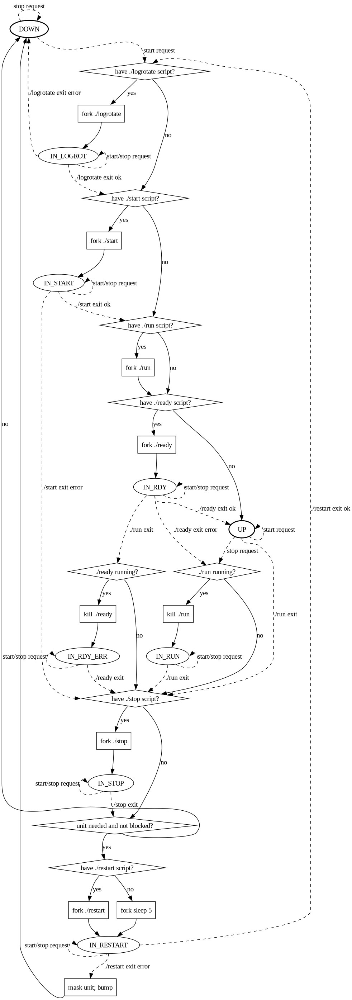

# wsunit

`wsunit` is a unit manager, similar to systemd, openrc, or daemontools. It can
also serve as an init system, running as PID 1.

**WARNING**; `wsunit` is in early development. It is neither well tested nor
well documented yet; features may change at any moment without prior warning.
Using `wsunit` in a production setup is NOT RECOMMENDED at this point!

## Paths

`wsunit` uses three directories:

- `WSUNIT_CONFIG_DIR` contains the unit definitions.
- `WSUNIT_STATE_DIR` contains unit state information and some control files.
- `WSUNIT_LOG_DIR` contains logs.

These directories must be set as environment variables for `wsunitd`. The
helper scripts `wsunitd-system` and `wsunitd-user` (see below) automatically set
the variables and start `wsunitd`.

## Units

A unit has a directory in `WSUNIT_CONFIG_DIR`, which may be empty or contain any
number of the following:

- An executable `logrotate` file.
- An executable `start` file.
- An executable `run` file.
- An executable `ready` file.
- An executable `stop` file.
- A directory named `deps`. Every file in this directory declares a dependency
  on the unit with the same name. File contents are ignored.
- A directory named `revdeps`. Every file in this directory declares a reverse
  dependency on the unit with the same name. File contents are ignored.
- A file named `restart`, indicating that the unit should be restarted when
  it goes down unexpectedly. Not implemented yet.
- A file named `start-wait-settle`, indicating that the unit should only be
  started after all units that should be brought down have reached the _down_
  state.
- A directory named `events`, containing executable files.

### Unit States

Externally, each unit is in one of three states:

- **down**: No components of the unit are running, the services provided by the
  unit are not ready.
- **running**: Components of the unit are running, but the services provided by
  the unit are not ready.
- **ready**: The services provided by the unit are ready, components may or may
  not be running.

This is a simplification of the internal state as described in _Unit Lifecycle_.

Additionally, a unit can be:

- **wanted**: This unit is explicitly marked as _wanted_. The special unit
  `@default` is always _wanted_ outside the shutdown phase, and the special unit
  `@shutdown` is always _wanted_ during the shutdown phase.
- **needed**: A unit is _needed_ if it is _wanted_, or if any of its reverse
  dependencies are _needed_.
- **masked**: This unit is explicitly marked as _masked_.
- **blocked**: A unit is _blocked_ if it is _masked_, or if any of its
  dependencies are _blocked_.

With each step, `wsunit` tries to bring up units that are _needed and not
blocked_, and tries to bring down all other units.

### Dependencies

Each unit may have any number of dependencies and reverse dependencies. If `a`
is a dependency of `b`, `b` is a reverse dependency of `a` and vice versa.
Dependencies can be declared from either direction
(`WSUNIT_CONFIG_DIR/<a>/revdeps/<b>` is equivalent to
`WSUNIT_CONFIG_DIR/<b>/deps/<a>)`) or from both at once. Dependencies enforce
the following relations:

- A unit cannot start until all its dependencies are _ready_.
- A unit cannot stop until all of its dependencies are _down_.

Additionally, as outlined in _Unit States_:

- A needed unit will cause all of its dependencies to be needed as well.
  `wsunit` will try to bring them into the `ready` state if they are not
  blocked, even if the original unit is blocked.
- A blocked unit will cause all of its reverse dependencies to be blocked as
  well.

Dependencies may not form a cycle. If a cycle is detected, a warning is issued
and an arbitrary dependency / reverse dependency declaration pair is ignored
until the units are reloaded.

### Unit Lifecycle

The following texts are a simplification, the exact behaviour is defined in the
diagram below.

On start (each if applicable):

- The `logrotate` file is called with `WSUNIT_LOG_DIR` as working directory,
  stdout and stderr will append to `WSUNIT_LOG_DIR/<name>.log`, the first
  argument will be the name of the unit. If this script fails, the unit returns
  to the `DOWN` state.
- The `start` file is called with the unit's directory in `WSUNIT_CONFIG_DIR` as
  working directory, stdout and stderr will append to
  `WSUNIT_LOG_DIR/<name>.log`. If this script fails, the unit returns to the
  `DOWN` state.
- The `run` file is started with the unit's directory in `WSUNIT_CONFIG_DIR` as
  working directory, stdout and stderr will append to
  `WSUNIT_LOG_DIR/<name>.log`. If this script exits, the unit begins the stop
  process.
- The `ready` file is called with the unit's directory in `WSUNIT_CONFIG_DIR`
  as working directory, stdout and stderr will append to
  `WSUNIT_LOG_DIR/<name>.log`. The unit is marked ready as soon as this script
  exits.

On stop (each if applicable):

- The `stop` file is called with the unit's directory in `WSUNIT_CONFIG_DIR` as
  working directory, stdout and stderr will append to
  `WSUNIT_LOG_DIR/<name>.log`. The unit is marked as down as soon as this script
  exits.

Details:

| Internal State | External State |
|:--------------:|:--------------:|
| `DOWN`         | _down_         |
| `IN_LOGROT`    | _running_      |
| `IN_START`     | _running_      |
| `IN_RDY`       | _running_      |
| `UP`           | _ready_        |
| `IN_RDY_ERR`   | _running_      |
| `IN_RUN`       | _running_      |
| `IN_STOP`      | _running_      |

## Events

`wsunit` has a simple event handling system built-in.

An event is triggered by writing its name, to the pipe
`WSUNIT_STATE_DIR/events`, followed by a newline character. The event name,
including the terminating newline character, must be less than `PIPE_BUF`
(>= 512) characters long, and may not contain the `/` character.

An event handler is an executable file inside the `events/` subdirectory of a
unit's directory. The name of the executable is the name of the event it is
called for.

When an event is triggered, the corresponding event handlers of every unit that
is *ready* are started with the name of the unit and the name of the event as
parameters. The order of start and termination of event handlers is undefined,
i.e. it is a mistake to assume any particular handler starts or terminates
before or after any other handler.

Event handlers are started inside their own process group, and any remaining
processes are terminated when the main process exits.

The runtime of an event handler is assumed to be negligible. `wsunit` will
neither delay stopping units until their event handlers terminate, nor handle
the case where another event is triggered before all event handlers terminate.

## The `wsunitd` Process

This process is the main "server" executable. It needs to be started with the
path environment variables (see _Paths_) set. The process reads the units from
the specified directories, and tries to bring them into their desired states.
It then supervises them and reacts to commands delivered by signals.

### Signals

- When `wsunitd` receives a `SIGUSR1`, it refreshes its list of wanted and
  masked units from `WSUNIT_STATE_DIR`, and tries to bring all units into their
  goal state. This includes restarting units that stopped and were not
  immediately restarted (as requested by a `WSUNIT_CONFIG_DIR/<unit>/restart`
  file).
- When `wsunitd` receives a `SIGUSR2`, it refreshes its internal set of units
  and their dependencies, and then proceeds with the actions for `SIGUSR1`.
- When `wsunitd` receives a `SIGTERM` or `SIGINT`, it switches to shutdown mode.
  The `@shutdown` unit replaces the `@default` unit as the implicitly wanted
  unit. The process then behaves as if it received a `SIGUSR1`.

## Helper Scripts

### `wsunitd-system` and `wsunitd-user`

`wsunitd-user` sets the variable `XDG_RUNTIME_DIR` to `/tmp/<userid>.runtime`
and sets up the directory, if the variable is not already set.

Both scripts set the following environment variables:

| Variable            | `wsunitd-system`  | `wsunitd-user`            | `wsunitd-user` fallback         |
|:-------------------:|:-----------------:|:-------------------------:|:-------------------------------:|
| `WSUNIT_CONFIG_DIR` | `/etc/wsunit`     | `$XDG_CONFIG_HOME/wsunit` | `$HOME/.config/wsunit`          |
| `WSUNIT_STATE_DIR`  | `/run/wsunit`     | `$XDG_RUNTIME_DIR/wsunit` | -                               |
| `WSUNIT_LOG_DIR`    | `/var/log/wsunit` | `$XDG_DATA_HOME/wsunit`   | `$HOME/.local/share/wsunit/log` |

Then they `exec` into `wsunitd`. `wsunitd-user` can be given the `--dbus` option
to run `wsunitd` inside a dbus session.

### `wsunit`

The `wsunit` script can be used to interact with a running `wsunitd` instance.
Run `wsunit help` for more info.

### `logmgr`

TODO
